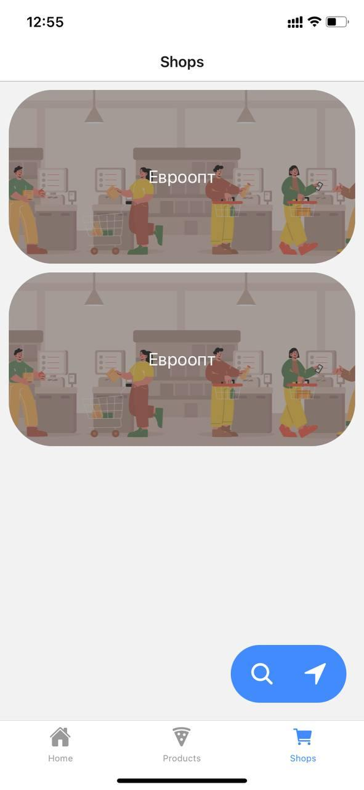

# UniSS mobile app

# There is a [back-end](https://github.com/zovenor/unified_system_of_shops) for this app

* # Login

* # Home

* # ProductsStack

* # ShopsStack

* # Settings

* # Search

* # Product info

* # Scanner

* # ProductInfoAfterScanning

